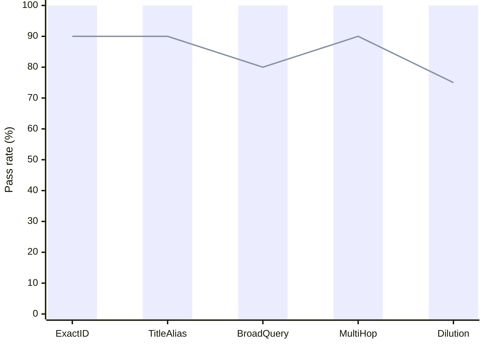

# Don't Ask AI to Search Your Mess: Why Context Needs Structure Before the Query

*Why a founder's memory has to be resolved before the question arrives.*

**The short version**

**The problem:** Asking an AI to search raw emails and texts under a deadline forces it to guess identities, connect scattered threads, and infer promises on the fly. You get a fluent answer, but you can't tell what's true.

**The fix:** Move the work from query time to capture time. Resolve who's who and record commitments with direct receipts as messages arrive.

**The takeaway:** AI reasoning is only as good as the record it stands on. Don't ask an LLM to reconstruct your week from scratch; give it a pre-resolved, verifiable record.

---

## Your week did not arrive as a database

It is Tuesday. Amara calls in ten minutes about the term sheet.

You ask the assistant you already use: *what is still open with Amara, and what did I promise Dele this week?*

The answer comes back clean and immediate. Part of it is true. You are out of time, and you cannot tell which part.

The problem began before you asked.

Amara moved a close date by email.

You promised Dele the revised numbers by text.

A voicemail came in while you slept.

Harbor 12 moved a date in a message from a domain one character away from theirs.

The same people repeat across channels. One company may use two domains and sit beneath a parent. A promise is buried inside a sentence that may also contain a suggestion, a joke, or a thought spoken too early.

Before anything can answer *what did I promise?*, something has to decide who the message concerns, which company it belongs to, and whether the sentence records a commitment at all.

Where that decision happens changes the answer.

---

## Search finds messages. Memory settles what they mean.

Inbox search can find every message that mentions Amara. It cannot tell you, by itself, that a text replaced the date in an earlier email or that a second address belongs to the same person.

Giving an assistant raw access does not remove that work. It asks the model to search, connect identities, infer relationships, and decide what counts as a commitment while it is composing the answer. Every question repeats the reconstruction. A different query can produce a different version of the same week.

The other path is to decide when the material arrives.

Resolve the message to the person and company it concerns when the source supports the match. Record a commitment when the words support one. Link that record to the exact message and keep the original beside it. When the question arrives, the assistant retrieves a record that already carries its evidence.

```text
SEARCH AND INFER             RESOLVE AND RECORD
raw messages                 incoming material
     |                             |
  question                      capture
     |                             |
live reconstruction           cited record
```

Voe takes the second path. Resolve on the way in. Keep the receipt. Answer from the record.

---

## Four quiet failures

**One person, three addresses.** The same person arrives by email, text, and voicemail. A question-time system may treat them as three strangers, or join two people who happen to share a name.

**One company, two domains.** Search one domain and you undercount. Guess the parent and you may pull in a subsidiary that is not part of the question.

**A suggestion that sounds like a promise.** A transcript says, "we should introduce Northbank." Is that a commitment, a possibility, or a thought out loud? If the model decides while writing the answer, there is no settled reading to inspect later.

**A call that never reached the record.** The timeline was agreed on a call. The memory has the voicemail before it, but not the call itself. Nothing in the captured material can recover what happened next.

These failures do not look like database errors. They arrive as ordinary prose. The answer is smooth enough to carry into the meeting, which is exactly the problem.

---

## A resolved record answers differently

Voe moves the first decision to capture, where it happens once and remains open to inspection.

When the source supports the match, Voe connects a message to the people and companies it concerns across the channels it can hear. When the match is uncertain, Voe keeps that uncertainty visible instead of silently completing it inside an answer.

A supported commitment becomes part of the record and stays linked to the message it came from. The original remains beside every reading derived from it.

Now *what did I promise Dele?* is not asking the model to reconstruct the week from scratch. The assistant can retrieve the promise, the message, and the time, then reason over them. Each claim can point back to its receipt.

And when the record does not contain the answer, Voe names the missing thing:

> I do not hold the call itself. I only hold the voicemail before it.

That sentence changes what you do next. You can ask for the notes, forward the thread, or walk into the meeting knowing exactly where memory stops.

None of this makes a model infallible. A model can still misread a question, reason badly, or answer too broadly. A resolved record removes a different class of failure: asking the model to invent identities, relationships, and missing events under deadline.

The promise is simple: the record is resolved before the answer, and every supported reading remains tied to what arrived.

---

## What the evidence says

Answer quality begins with the record a model receives.

One external result is relevant, with an important limit.

Sequeda, Allemang, and Jacob tested GPT-4 on zero-shot question answering over an enterprise insurance database. Asked directly against the SQL tables, it reached 16% accuracy. Asked over a semantic representation built from the same database, with business meaning expressed through an ontology and mappings, it reached 54%.

Same model. Same underlying database. Different representation.

This was not a Voe evaluation, and it was not a test over inboxes, texts, or voicemail. It does not prove that every resolved record produces a correct answer. It does show that the structure presented to a model can move answer accuracy substantially, even when the model and the underlying facts stay the same.

The useful lesson is simpler: representation matters. Reasoning can navigate relationships that were recorded. It cannot recover a relationship the record never made explicit.

More compute over unresolved material may produce a better reading of the pile. It does not turn the pile into a settled record.

### A smaller check inside Voe

Voe also runs a small, curated retrieval regression gate. It asks whether the correct page appears among content designed to be confusing. This is not answer accuracy, not a production traffic study, and not comparable to the external benchmark above.

In this run, the suite cleared all 56 retrieval challenges across five families. The bars show pass rate. The line shows the minimum release threshold for each family.



| Retrieval family | Passed | Pass rate | Release threshold |
| --- | ---: | ---: | ---: |
| Exact identifier | 20 of 20 | 100% | 90% |
| Title alias | 12 of 12 | 100% | 90% |
| Generic to specific | 6 of 6 | 100% | 80% |
| Multi-hop | 10 of 10 | 100% | 90% |
| Dilution | 8 of 8 | 100% | 75% |

The result means a retrieval change did not lose any of the known hard cases in this suite. It does not mean Voe answers real-world questions with 100% accuracy.

---

## What connecting your tools should mean

A connection can give an assistant more material without giving it a settled record. More sources also mean more identities, aliases, contradictions, and missing relationships to infer while answering.

Voe sits before that moment. It gives the assistant a cited record built from what arrived, with the original still one tap away and the missing parts named.

The assistant still does the thinking and the talking. Voe gives it memory with receipts.

You do not get a perfect answer by definition. You get an answer that can be checked, and a record that does not have to be reconstructed every time you ask.

---

## Where Voe stops

Voe never sends a word on your behalf.

A connected agent can add or amend records only when the workspace owner has separately allowed it. That changes the record; it does not give Voe a hand in the outside world.

Voe knows only what has been passed to it. A call that was never captured remains a call it does not have.

It keeps the original material beside what was read from it. When an answer matters, you can inspect the source instead of taking the prose on faith.

Those limits are part of the product. A memory that names where it stops is more useful than one that fills the silence.

---

## Back to Tuesday

The model was not the first problem.

Before the assistant can reason well, the record has to know that three messages concern the same Dele, that two domains belong to Harbor 12, that a sentence was a commitment, and that the call after the voicemail is missing.

With a resolved, cited record, the assistant can tell you what Amara changed, what you promised Dele, why the Harbor 12 message needs a closer look, and which part of the week never arrived.

That does not make the answer perfect. It makes the claims inspectable and the silence explicit.

**What is held has a receipt. What is missing is named.**

---

## Source

Juan Sequeda, Dean Allemang, and Bryon Jacob, 2023. [Enterprise question answering benchmark, arXiv:2311.07509](https://arxiv.org/abs/2311.07509). The figures cited above are GPT-4 zero-shot accuracy: 16% over SQL tables and 54% over the paper's semantic representation.
