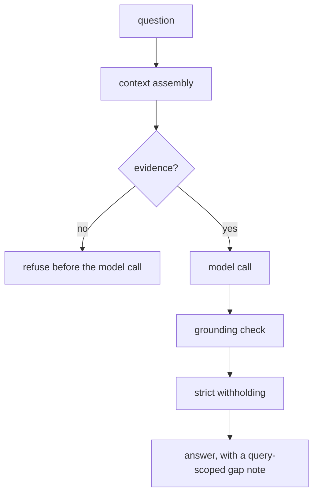

# Honest refusal and bounded reasoning

**The lesson:** Voe makes the limits of memory machine-readable, so an agent knows when to stop reasoning.

**Flows in:** anything already captured; this pattern is read-side.

**You call:** `context` to assemble the bundle, then `POST /v1/think` for the grounded answer and its gap note.

**The path:**

**Three behaviors to render:**

1. **Refuse before spending a call.** When the assembled bundle holds no evidence for the question, `think` refuses instead of asking the model to improvise over an empty record. "I hold nothing that answers that yet" is a result, not a failure, and it costs nothing.
2. **Strict withholding, counted.** In strict mode, a sentence the grounding check cannot tie to a real source is withheld, and the number withheld is named. The machine caller receives already-checked text, not a warning it has no eyes to read.
3. **Gap note scoped to the question.** The gap is about *this* question - what is missing, stale, or unreadable for it - so your software sees the absence once instead of searching the same hole again.

**The user can inspect:** the answer's citations resolve to their records; the withheld count and the gap note are returned as part of the response, not narrated around it.

**Why it matters:** this is an honesty property and a cost property at once. An agent that can read "no evidence" and "here is exactly what is missing" stops reasoning at the right place, which is cheaper and more truthful than one that fills the silence.

> **On numbers.** When you have measured it on your own fixtures, this pattern is a fair place to publish an eval receipt: tokens per correctly cited answer against naive top-k over the same set. Do not publish a figure before it is measured. An unmeasured number is the opposite of what this pattern is about.
